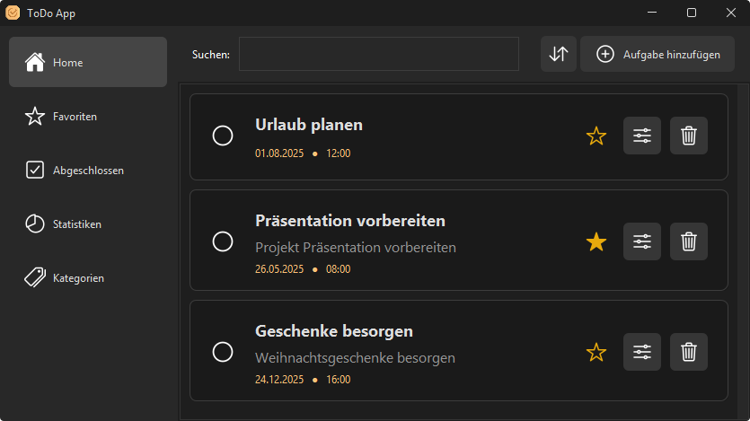
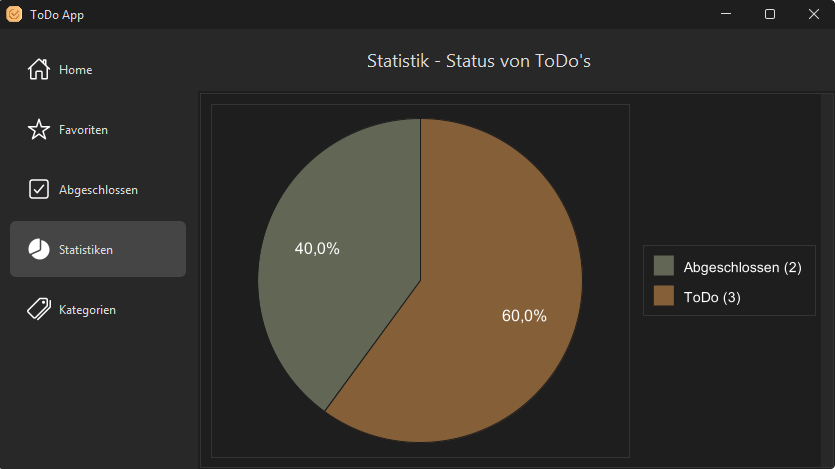

<div align="center">
  
  <h1>ToDo-App</h1>
  <p>📝 Organisiere deine Aufgaben einfach, schnell und übersichtlich!</p>
</div>

---

## 🚀 Features

- Aufgaben erstellen, bearbeiten und löschen
- Aufgaben als erledigt markieren
- Kategorien für bessere Übersicht
- Fälligkeitsdatum und Prioritäten setzen
- Favoriten & Notizen zu Aufgaben hinzufügen
- Suchfunktion für Aufgaben und Kategorien
- Statistiken & Diagramme zum Fortschritt
- Benutzerfreundliche Oberfläche im modernen Design

## 🖥️ Screenshots

<p align="center">
  
  
</p>

## ⚡ Schnellstart

**1. Repository klonen**

```sh
git clone https://github.com/DaBorsten/ToDo-App.git
cd ToDo-App
```

**2. Builden**

```sh
./gradlew build
```

**3. Starten**

```sh
./gradlew run
```

## 🛠️ Technologien

- Java 17+
- Swing (GUI)
- Gradle (Build-Tool)
- XChart (Diagramme)

## 📄 Lizenz

Dieses Projekt steht unter der <a href="LICENSE">GNU GPL-3.0 Lizenz</a>.
